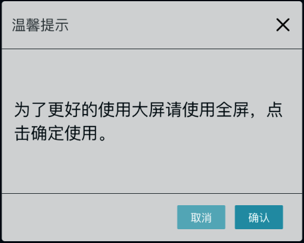

# 对话框



<template>
	<fs-button type='light' @click="show">试一下</fs-button>
</template>

<script>
export default {
	mounted() {},
	methods: {
		show() {
			this.$Dialog({
				title: '温馨提示',
				text: '这是一个对话框',
				onConfirm() {},
			});
		},
	},
};
</script>

### 参数

| 参数      | 说明       | 类型   | 默认值 |
| --------- | ---------- | ------ | ------ |
| title     | 对话框标题 | String | -      |
| text      | 对话框消息 | String | -      |
| onConfirm | 确认回调   | method | -      |
| coCancel  | 取消回调   | method | -      |


### 方法

#### onConfirm()
点击确定时时调用的回调方法；
#### onCancel()
点击取消时调用的回调方法；

``` js
<script>
export default {
	mounted() {},
	methods: {
		show() {
			this.$Dialog({
				title: '温馨提示',
				text: '这是一个对话框',
				onConfirm() {},
			});
		},
	},
};
</script>
```