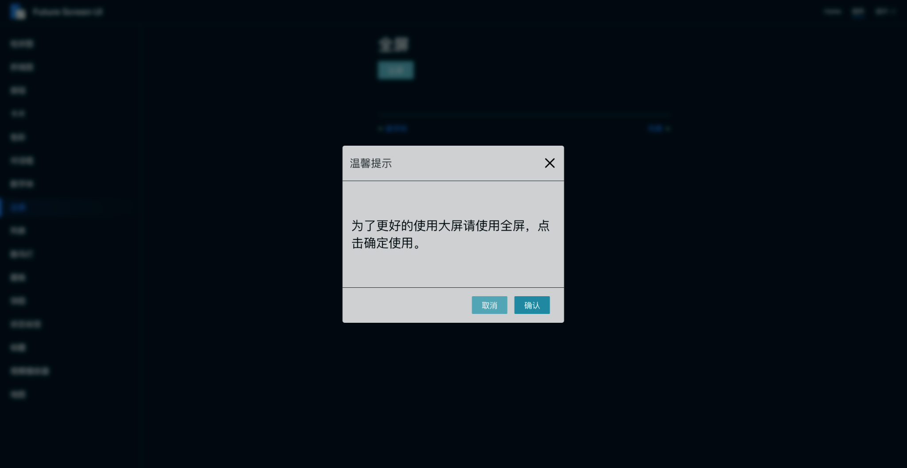

# 全屏


<template>
	<fs-button @click="show" type='prπimary'>试一下</fs-button>
</template>

<script>
export default {
	mounted() {},
	methods: {
		show() {
			this.$Dialog({
				title: '温馨提示',
				text: '为了更好的使用大屏请使用全屏，点击确定使用。',
				onConfirm() {this.$fullscreen()},
			});
		},
	},
};
</script>

### 使用
``` js
this.$fullscreen()
```

在vue里使用this.$fullscreen()触发，再次调用关闭。